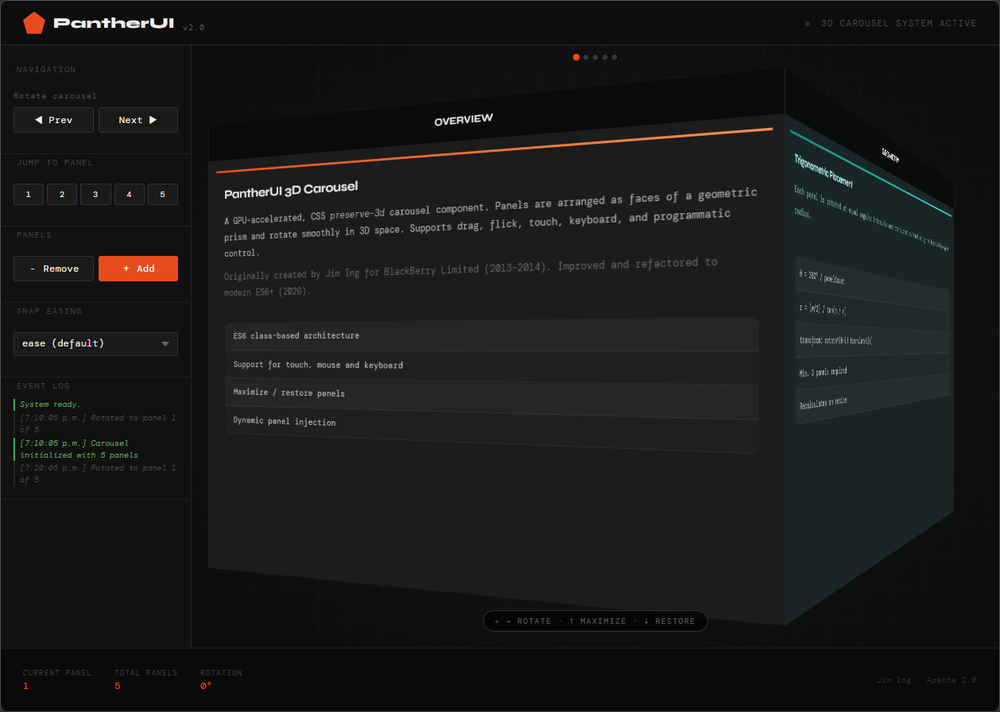

# PantherUI

A lightweight 3D carousel UI component library. Panels rotate on a CSS `rotateY` cylinder using the Pointer Events API for unified mouse, touch, and stylus input.



Originally by Jim Ing (@jim_ing) for BlackBerry Limited (2013–2014). Refactored to modern ES6+ (2026).

Licensed under the [Apache License 2.0](https://www.apache.org/licenses/LICENSE-2.0).

---

### Demos

- [Full](demo.html)
- [Basic](demo-basic.html)
- [WorldDash](worlddash.html) - displays world clocks with live weather for up to four cities

---

## Files

| File | Description |
|---|---|
| `PantherUI.js` | Library — `Carousel3D` class and `Panther.Carousel` module |
| `PantherUI.css` | Base carousel styles |

---

## Quick Start

```html
<link rel="stylesheet" href="PantherUI.css"/>

<!-- Carousel container -->
<div class="panther-Carousel-container" id="container-demo">
  <div class="panther-Carousel-carousel" id="my-carousel">
    <figure>
      <div class="panther-Carousel-panelTitleBar">
        <span class="panther-Carousel-panelTitle">Panel 1</span>
      </div>
      <div class="panther-Carousel-panelContent">Content A</div>
    </figure>
    <figure>
      <div class="panther-Carousel-panelTitleBar">
        <span class="panther-Carousel-panelTitle">Panel 2</span>
      </div>
      <div class="panther-Carousel-panelContent">Content B</div>
    </figure>
    <figure>
      <div class="panther-Carousel-panelTitleBar">
        <span class="panther-Carousel-panelTitle">Panel 3</span>
      </div>
      <div class="panther-Carousel-panelContent">Content C</div>
    </figure>
  </div>
</div>

<script src="PantherUI.js"></script>
<script>
  Panther.Carousel.init({
    id: 'my-carousel',
    easing: 'easeInOutCubic',
    callback(c) {
      console.log('Now showing panel', c.sideIndex);
    }
  });
</script>
```

A minimum of **3 panels** is required for the 3D geometry to work.

---

## DOM Structure

```
.panther-Carousel-container        ← receives pointer events, sized to fill parent
  .panther-Carousel-carousel       ← rotates in 3D (transform-style: preserve-3d)
    figure                         ← one per panel (any count ≥ 3)
      .panther-Carousel-panelTitleBar
        .panther-Carousel-panelTitle
      .panther-Carousel-panelContent
```

The container must have an explicit width and height (or be inside a sized parent) before `init()` is called, since panel geometry is calculated from `offsetWidth` at init time.

---

## API Reference

All methods are on the `Panther.Carousel` namespace.

### `init(opts)` → `Carousel3D | null`

Initialise a carousel. Must be called after the element is in the DOM with a non-zero width.

```js
Panther.Carousel.init({
  id:              'my-carousel',   // required — ID of the carousel element
  backgroundColor: '#1a1a2e',       // optional — panel background colour
  easing:          'easeOutExpo',   // optional — named key or raw CSS transition
  callback:        (c) => {}        // optional — called on every panel change
});
```

`callback` receives the `Carousel3D` instance. Useful fields:

| Property | Type | Description |
|---|---|---|
| `c.sideIndex` | `number` | 0-based index of the currently visible panel |
| `c.panelCount` | `number` | Total number of panels |
| `c.rotation` | `number` | Current rotation in degrees |

---

### `refresh()`

Recalculate geometry for all carousels. Call after a resize or orientation change (PantherUI also does this automatically via `window.addEventListener('resize', ...)`).

```js
Panther.Carousel.refresh();
```

---

### `turnNext(carouselId)`

Rotate one panel forward.

```js
Panther.Carousel.turnNext('my-carousel');
```

---

### `turnPrev(carouselId)`

Rotate one panel backward.

```js
Panther.Carousel.turnPrev('my-carousel');
```

---

### `turnTo(carouselId, side, callback?)`

Rotate to a specific panel by **1-based** index. Accepts a single ID or an array of IDs to turn multiple carousels simultaneously.

```js
Panther.Carousel.turnTo('my-carousel', 3);

// Turn multiple carousels to the same panel
Panther.Carousel.turnTo(['carousel-0', 'carousel-1', 'carousel-2'], 2, (id, side) => {
  console.log(id, 'turned to', side);
});
```

---

### `setEasing(carouselId, easing)`

Set the snap-transition easing for a single carousel. Accepts a named key from `EASINGS` or a raw CSS transition string.

```js
Panther.Carousel.setEasing('my-carousel', 'easeOutBack');
Panther.Carousel.setEasing('my-carousel', '500ms ease-in-out');
```

---

### `setAllEasings(easing)`

Set the snap-transition easing for all active carousels at once.

```js
Panther.Carousel.setAllEasings('easeOutExpo');
```

---

### `setSensitivity(value)`

Set the drag sensitivity multiplier for all carousels. `1.0` requires dragging one full panel-width to rotate one face. Values above `1.0` reduce the distance required. Clamped to `0.5 – 5.0`.

```js
Panther.Carousel.setSensitivity(2.0); // half the panel width rotates one face
```

---

### `maximize(carouselId)`

Expand a carousel's container to fill the viewport. Hides all other carousels.

```js
Panther.Carousel.maximize('my-carousel');
```

---

### `restore(carouselId)`

Restore a maximized carousel to its original size and show all other carousels.

```js
Panther.Carousel.restore('my-carousel');
```

---

### `addPanel(title, content)` — instance method

Dynamically add a new panel to a carousel. Calls `refresh()` automatically.

```js
const c = Panther.Carousel.all['my-carousel'];
c.addPanel('Panel 4', '<p>Dynamic content</p>');
```

---

### `removeLastPanel(carouselId)` → `boolean`

Remove the last panel. Enforces a minimum of 3 panels; returns `false` if at minimum.

```js
Panther.Carousel.removeLastPanel('my-carousel');
```

---

### `all`

Registry of all active `Carousel3D` instances, keyed by element ID.

```js
const c = Panther.Carousel.all['my-carousel'];
console.log(c.sideIndex, c.panelCount, c.rotation);
```

---

## Easings

Named easing presets available via `setEasing` / `setAllEasings` / `init({ easing })`:

| Key | CSS value | Character |
|---|---|---|
| `ease` | `750ms ease` | Browser default |
| `linear` | `750ms linear` | Constant speed |
| `easeIn` | `750ms ease-in` | Slow start |
| `easeOut` | `750ms ease-out` | Slow end |
| `easeInOut` | `750ms ease-in-out` | Slow start and end |
| `easeInOutSine` | `750ms cubic-bezier(0.45, 0, 0.55, 1)` | Gentle S-curve |
| `easeInOutCubic` | `750ms cubic-bezier(0.65, 0, 0.35, 1)` | Medium S-curve *(default)* |
| `easeInOutQuart` | `750ms cubic-bezier(0.76, 0, 0.24, 1)` | Strong S-curve |
| `easeInOutQuint` | `750ms cubic-bezier(0.87, 0, 0.13, 1)` | Very strong S-curve |
| `easeOutBack` | `750ms cubic-bezier(0.34, 1.56, 0.64, 1)` | Slight overshoot |
| `easeOutExpo` | `400ms cubic-bezier(0.16, 1, 0.3, 1)` | Snappy, fast settle |
| `easeInOutBack` | `1100ms cubic-bezier(0.68, -0.55, 0.27, 1.55)` | Elastic bounce |

Access the full map at runtime via `Panther.Carousel.EASINGS`.

---

## Drag Behaviour

Input is handled via the [Pointer Events API](https://developer.mozilla.org/en-US/docs/Web/API/Pointer_events), which unifies mouse, touch, and stylus into a single event stream. `setPointerCapture` keeps the drag live even if the pointer leaves the element.

**Pixel-to-degrees mapping:**
```
rotation_delta = dx_pixels × (theta / panelSize) × sensitivity
```
Where `theta = 360 / panelCount` and `panelSize = element.offsetWidth`.

At the default sensitivity of `1.0`, dragging one full panel-width rotates exactly one face. At `2.0`, half the panel-width is sufficient.

**Flick / momentum:** if the pointer was moving faster than `0.3 deg/ms` at release, the carousel automatically advances one extra panel in the flick direction.

**Deadzone:** movements under 6px are treated as clicks, not drags.

---

## CSS Custom Properties

| Property | Default | Description |
|---|---|---|
| `--panther-transition` | `750ms cubic-bezier(0.65, 0, 0.35, 1)` | Snap transition applied to the carousel element. Set per-container by `setEasing()`. |

---

## Carousel3D Instance Properties

| Property | Type | Default | Description |
|---|---|---|---|
| `id` | `string` | `''` | Element ID |
| `rotation` | `number` | `0` | Current rotation in degrees |
| `panelCount` | `number` | — | Number of panels |
| `panelSize` | `number` | — | `offsetWidth` of the carousel element |
| `theta` | `number` | — | Degrees per face (`360 / panelCount`) |
| `radius` | `number` | — | Cylinder radius in pixels |
| `sideIndex` | `number` | `0` | 0-based index of the front-facing panel |
| `sensitivity` | `number` | `1.0` | Drag multiplier |
| `backgroundColor` | `string` | `'rgb(209,209,209)'` | Default panel background |
| `maximized` | `boolean` | `false` | Whether the carousel is currently maximized |
| `callback` | `function\|null` | `null` | Called on every panel change |

---

## Browser Support

Requires: CSS `transform-style: preserve-3d`, CSS Custom Properties, Pointer Events API, ES6 classes.

Tested on: Chrome 120+, Firefox 121+, Safari 17+, Chrome for Android, Safari for iOS.
