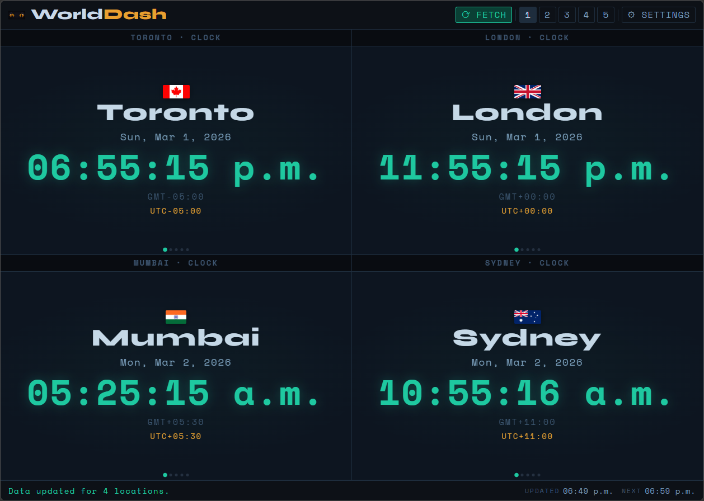
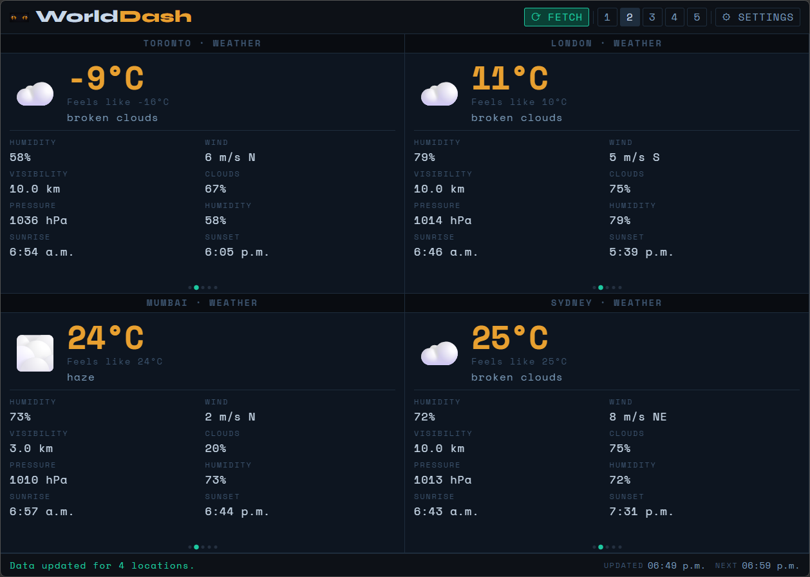
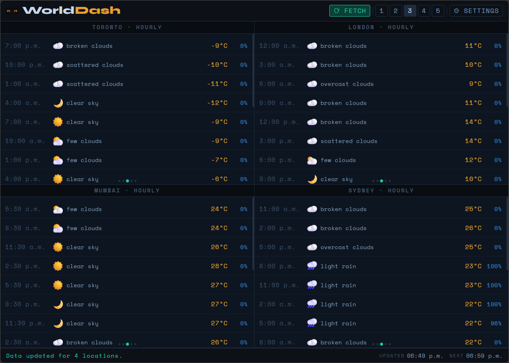
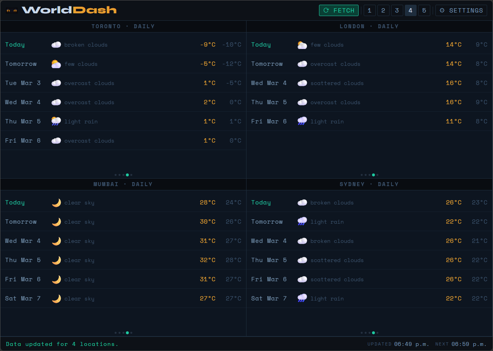
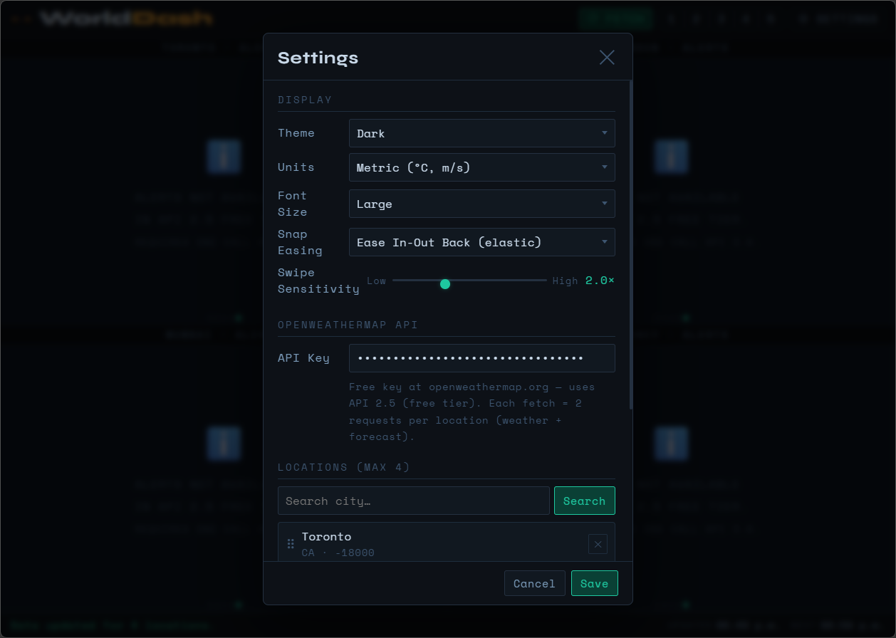

# WorldDash

A Progressive Web App that displays world clocks with live weather for up to four cities simultaneously. Each city gets a 3D rotating carousel (powered by PantherUI) with five panels: clock, current weather, hourly forecast, daily forecast, and alerts.

**Screenshot 1: World clocks**



**Screenshot 2: Current weather**



**Screenshot 3: Hourly forecast**



**Screenshot 4: Daily forecast**



**Screenshot 5: Settings**



---

## Files

| File | Description |
|---|---|
| `worlddash.html` | App shell, markup, SVG logo, settings dialog |
| `worlddash.css` | All styles — design tokens, layout, panels, responsive breakpoints |
| `worlddash.js` | Application logic — state, clocks, weather API, carousel wiring, settings |
| `PantherUI.js` | 3D carousel library (see `README.md`) |
| `PantherUI.css` | Carousel base styles |

Serve all five files from the same directory. No build step required.

---

## Requirements

- A free [OpenWeatherMap](https://openweathermap.org/api) API key (API 2.5, free tier)
- A modern browser with ES6+, CSS Grid, and Pointer Events support
- An internet connection for weather data and flag images ([flagcdn.com](https://flagcdn.com))

---

## Getting Started

1. Open `worlddash.html` in a browser (or serve from a local server)
2. Click **⚙ SETTINGS**
3. Enter your OpenWeatherMap API key
4. Optionally add or reorder cities
5. Click **Save**, then **⟳ FETCH**

---

## Layout

### Desktop / Tablet (> 768px)
Four cells in a **2 × 2** grid, all visible simultaneously.

### Tablet portrait (601 – 768px)
Two cells in a **2 × 2** grid (all four visible).

### Mobile portrait (≤ 600px)
Single column, **4 rows of 50 vh** each. The top two carousels are visible; scroll down to reveal the bottom two. Each row snaps into place.

### Mobile landscape (≤ 600px landscape)
**2 × 2** grid, all four visible — no scrolling required.

---

## Panels

Each carousel has five panels, accessible by dragging/swiping or using the **1 – 5** toolbar buttons.

| # | Label | Content |
|---|---|---|
| 1 | CLOCK | Country flag, city name, live local time, date, timezone abbreviation, UTC offset |
| 2 | WEATHER | Current temperature, feels-like, conditions, wind, humidity, pressure, visibility, sunrise/sunset |
| 3 | HOURLY | 16-slot 3-hour forecast — time, icon, description, temperature, precipitation probability |
| 4 | DAILY | 6-day forecast — day, icon, description, high/low temperatures |
| 5 | ALERTS | Weather alerts (requires OpenWeatherMap One Call API 3.0; shows info panel on free tier) |

---

## Settings

Open via **⚙ SETTINGS**.

| Setting | Options | Description |
|---|---|---|
| Theme | Dark / Light | Colour scheme |
| Units | Metric / Imperial | °C + m/s or °F + mph |
| Font Size | Small (16px) / Medium (20px) / Large (24px) | Root font size, scales all UI elements |
| Snap Easing | 12 options | CSS transition used when the carousel snaps to a panel |
| Swipe Sensitivity | 0.5 – 5.0× | How far you need to drag to rotate one panel. Default: 2.0× |
| API Key | Text | OpenWeatherMap API key (stored in localStorage) |
| Locations | Search + reorder | Up to 4 cities; drag to reorder, ✕ to remove |
| Export / Import | JSON | Round-trip all settings and weather cache |

Settings are persisted to `localStorage` under the key `worlddash_v2`.

---

## Locations

Each location object:

```json
{
  "name": "Toronto",
  "country": "CA",
  "lat": 43.7001,
  "lon": -79.4163,
  "tz": "America/Toronto"
}
```

`tz` accepts either an IANA timezone string (`"America/Toronto"`) or a raw UTC offset in seconds as returned by the OpenWeatherMap API (e.g. `19800` for UTC+5:30). Half-hour and quarter-hour offsets (India, Iran, Nepal, etc.) are handled correctly.

After a successful fetch, `tz` is updated from the API response so the clock and forecast times always reflect the city's actual offset.

Default locations: Toronto, Vancouver, Calgary, Halifax.

---

## Weather API

WorldDash uses **OpenWeatherMap API 2.5** (free tier). Each fetch fires two requests per location:

```
GET /data/2.5/weather?lat={lat}&lon={lon}&units={units}&appid={key}
GET /data/2.5/forecast?lat={lat}&lon={lon}&units={units}&appid={key}
```

City search uses the Geocoding API:

```
GET /geo/1.0/direct?q={city}&limit=5&appid={key}
```

Weather data is cached in state and saved to localStorage. A fetch is skipped if data is less than 10 minutes old.

Country flags are loaded from `https://flagcdn.com/256x192/{cc}.png` using the `sys.country` field in the weather response.

---

## Toolbar

| Button | Action |
|---|---|
| ⟳ FETCH | Fetch fresh weather for all locations |
| 1 – 5 | Turn all carousels to that panel simultaneously |
| ⚙ SETTINGS | Open the settings dialog |

---

## Persistence

All state is serialised to JSON and stored in `localStorage` (`worlddash_v2`). The stored shape:

```json
{
  "apiKey": "",
  "units": "metric",
  "theme": "dark",
  "fontSize": "medium",
  "sensitivity": 2.0,
  "easing": "easeInOutCubic",
  "locations": [...],
  "weather": {},
  "lastFetch": null,
  "nextFetch": null
}
```

Use **Export JSON** to back up settings, and **Import JSON** to restore them across devices.

---

## Architecture

```
worlddash.html          Shell, dialog markup
worlddash.css
  ├── Design tokens      :root CSS custom properties
  ├── App chrome         header, stage, grid, footer
  ├── Panel styles       clock, weather, hourly, daily, alerts
  ├── Settings dialog
  └── Responsive         portrait, landscape, mobile, tablet breakpoints

worlddash.js
  ├── Constants          LS_KEY, MAX_LOCATIONS, CAROUSEL_IDS, PANEL_LABELS
  ├── State              apiKey, units, theme, fontSize, sensitivity, easing,
  │                      locations, weather, lastFetch, nextFetch
  ├── Persistence        loadState(), saveState()
  ├── Utilities          fmtTemp(), fmtWind(), fmtPop(), fmtDate(), fmtTime(),
  │                      fmtUnixTime(), icon(), offsetSecsToLabel()
  ├── Timezone           localDate(), getTZAbbr(), getUTCOffset()
  ├── Clock              tickClock(), startClock()
  ├── Panel builders     buildClockPanel(), buildWeatherPanel(),
  │                      buildHourlyPanel(), buildDailyPanel(),
  │                      buildAlertsPanel(), buildPlaceholder()
  ├── Carousel setup     buildPanelHTML(), initCarousels(),
  │                      buildCarousels(), buildCarouselsDeferred(),
  │                      refreshPanel()
  ├── Fetch              fetchWeather(), normaliseForecast()
  ├── Settings           openSettings(), closeSettings(), applyTheme(),
  │                      populateEasingDropdown(), updateSensitivityLabel(),
  │                      searchLocations(), renderLocationList()
  └── Init               loadState → applyTheme → buildCarouselsDeferred
```

---

## Browser Support

Requires: CSS Grid, CSS Custom Properties, Pointer Events API, `Intl.DateTimeFormat.formatToParts`, `IntersectionObserver`, `fetch`, `localStorage`.

Tested on: Chrome 120+, Firefox 121+, Safari 17+, Chrome for Android, Safari for iOS.
